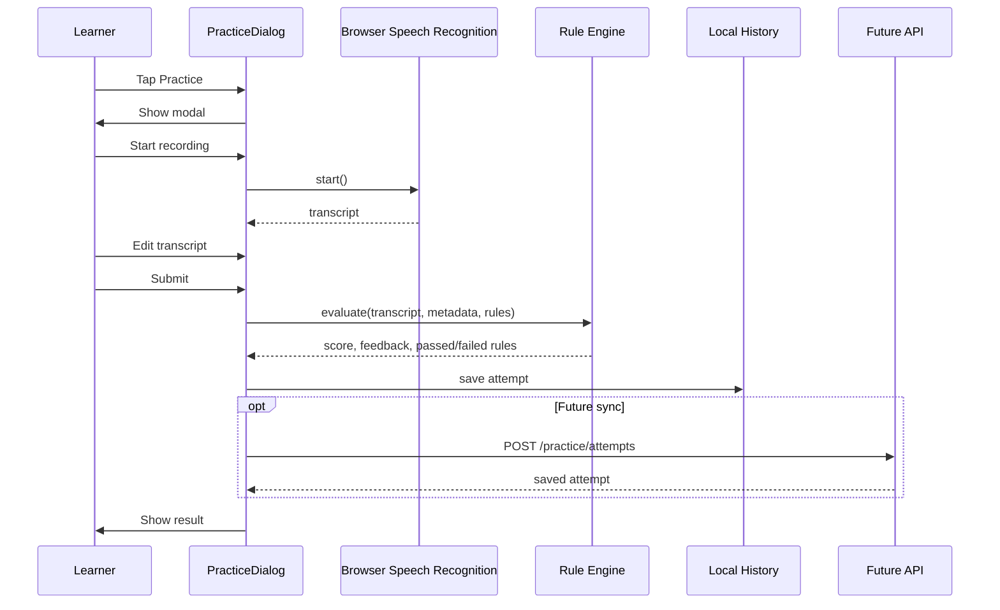

# LazyVoca Practice Feature Architecture

## Product Analysis

Practice helps learners move from recognizing vocabulary to actively using it. The MVP intentionally avoids pronunciation scoring and AI grading. Browser speech recognition is only a convenient input method; the learner can edit the transcript before submitting. Scoring is deterministic, explainable, and powered by reusable vocabulary metadata plus configurable rules, so the product can support 5000+ words without word-specific code.

## 1. UX Flow

```text
Vocabulary Detail/Card
  ↓ User taps Practice
Recording popup/modal
  ↓ Browser Speech Recognition or typed input
Editable transcript
  ↓ Submit
Configurable Rule Engine
  ↓ Score + feedback + passed/failed rules
Save history
  ↓ Retry or close
```

Simplification: for MVP, make Practice a modal launched from the current vocabulary card rather than creating a separate route. This reduces navigation complexity and keeps the learner focused on the active word.

## 2. UI Layout

Mobile-first modal:

```text
┌────────────────────────────────┐
│ Practice                        │
│ Use “target word”               │
│ Meaning/context card            │
├────────────────────────────────┤
│ [Start recording / Stop]        │
│ Speech support helper text      │
├────────────────────────────────┤
│ Editable transcript textarea    │
├────────────────────────────────┤
│ [Submit practice]               │
├────────────────────────────────┤
│ Score bar + numeric score       │
│ Feedback bullets                │
│ Passed/failed rule chips        │
└────────────────────────────────┘
```

## 3. Frontend Architecture

```text
src/components/practice/
  PracticeDialog.tsx        # modal UI, speech recognition, transcript editing

src/features/practice/
  metadata.ts               # default metadata derivation and default rule config
  ruleEngine.ts             # pure rule evaluation engine
  storage.ts                # local history persistence abstraction
  types.ts                  # domain contracts
```

Decisions:

- React is used because the existing project is React/Vite.
- Rule evaluation is pure TypeScript for testability and future server reuse.
- Local storage is used for MVP history; the storage module can later call a backend.

## 4. Backend Architecture

MVP can run client-only. Future backend should re-run validation before saving attempts:

```text
Client
  ├─ GET /api/v1/vocabulary/:id/practice-metadata
  ├─ POST /api/v1/practice/evaluate
  ├─ POST /api/v1/practice/attempts
  └─ GET /api/v1/practice/history
Backend
  ├─ PracticeController
  ├─ PracticeRuleService
  ├─ VocabularyMetadataRepository
  └─ PracticeAttemptRepository
Database
  ├─ vocabulary_practice_metadata
  ├─ practice_rule_sets
  └─ practice_attempts
```

## 5. Rule Engine Design

Rules are configurable objects rather than hard-coded per word:

```json
{
  "id": "target-word-exists",
  "enabled": true,
  "required": true,
  "weight": 30
}
```

Supported MVP rules:

- `target-word-exists`: transcript contains lemma or accepted form.
- `correct-word-form`: accepted form appears.
- `complete-sentence`: subject-like cue and verb-like cue are present.
- `minimum-length`: token count meets vocabulary metadata minimum.
- `basic-grammar`: simple punctuation/repeated-word checks.
- `collocation-bonus`: configured phrase appears.
- `semantic-match`: sentence includes semantic tag/keyword derived from meaning, example, or category.

Required-rule failures cap the score below passing so learners cannot pass without using the target word.

## 6. Database Schema

```sql
create table vocabulary_practice_metadata (
  vocabulary_id uuid primary key references vocabulary(id) on delete cascade,
  lemma text not null,
  word_forms text[] not null default '{}',
  part_of_speech text,
  collocations text[] not null default '{}',
  semantic_tags text[] not null default '{}',
  semantic_keywords text[] not null default '{}',
  minimum_sentence_length integer not null default 5,
  rule_set_id uuid references practice_rule_sets(id),
  created_at timestamptz not null default now(),
  updated_at timestamptz not null default now()
);

create table practice_rule_sets (
  id uuid primary key default gen_random_uuid(),
  name text not null,
  version integer not null default 1,
  rules jsonb not null,
  is_default boolean not null default false,
  created_at timestamptz not null default now()
);

create table practice_attempts (
  id uuid primary key default gen_random_uuid(),
  user_key text not null,
  vocabulary_id uuid not null references vocabulary(id) on delete cascade,
  transcript text not null,
  score integer not null,
  passed_rules text[] not null default '{}',
  failed_rules text[] not null default '{}',
  feedback jsonb not null,
  rule_set_version integer not null,
  created_at timestamptz not null default now()
);

create index practice_attempts_user_word_created_idx
  on practice_attempts(user_key, vocabulary_id, created_at desc);
```

## 7. API Endpoints

```http
GET /api/v1/vocabulary/:wordId/practice-metadata
POST /api/v1/practice/evaluate
POST /api/v1/practice/attempts
GET /api/v1/practice/history?wordId=:wordId&limit=10
```

`POST /api/v1/practice/evaluate` response:

```json
{
  "score": 86,
  "feedback": ["Strong practice sentence."],
  "passedRules": [{ "id": "target-word-exists" }],
  "failedRules": []
}
```

## 8. Sequence Diagram



## 9. Future AI Upgrade Path

- Keep deterministic rules as the baseline and offline fallback.
- Add optional AI feedback after rule scoring, not before.
- Use AI for naturalness suggestions and rewrites, not pronunciation scoring.
- Store rule result and AI feedback separately so costs can be controlled and audited.
- Use metadata quality improvements first; AI should enrich feedback, not replace structured vocabulary data.

## 10. Implementation Plan

1. Add product architecture document.
2. Add metadata, rule engine, storage, and domain types.
3. Add mobile-first Practice dialog.
4. Add Practice entry point to vocabulary controls.
5. Add rule-engine tests.
6. Later: add database migrations and API endpoints for synced history.
